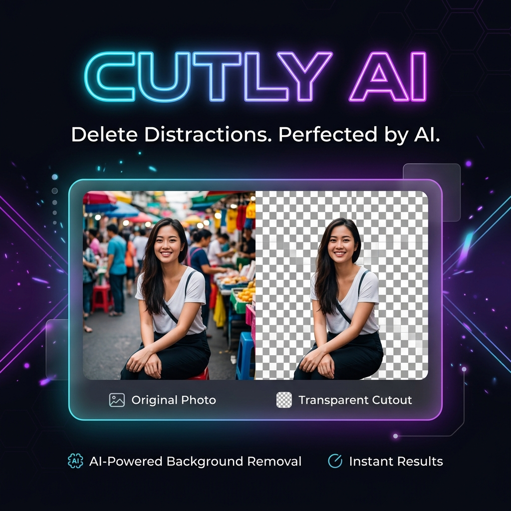
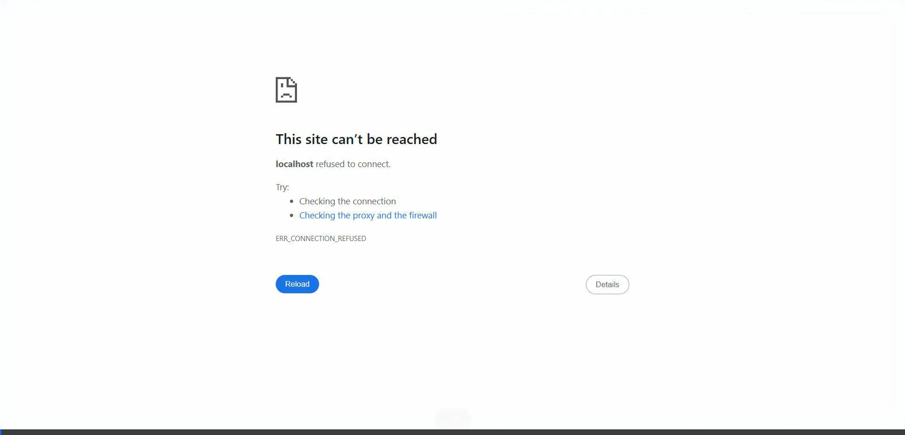
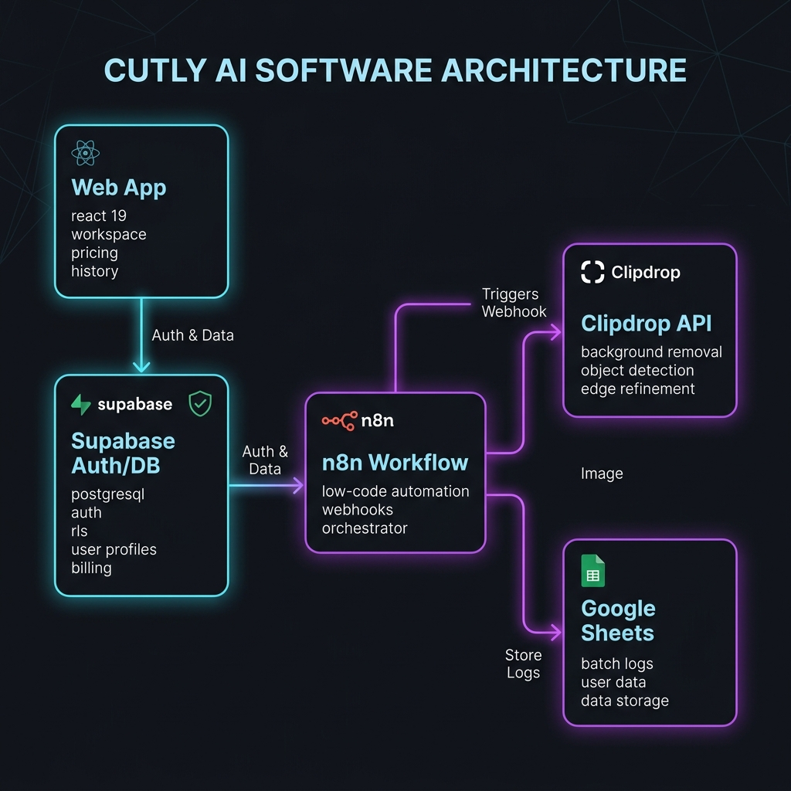

<div align="center">



<br />
<br />

<a href="https://github.com/Hexecutionerr/ai-cutout-engine">
  
</a>
<a href="https://github.com/Hexecutionerr/ai-cutout-engine/commits/main">
  
</a>


<br />
<br />

> **A simple and fast AI background removal web app.**  
> Built with React 19, TanStack, Supabase Auth/Database, Razorpay Payments, and an automated n8n batch workflow using the Clipdrop API and Google Sheets.

<br />

[](https://ai-cutout-engine.vercel.app)

</div>

---

## 📺 Live App Demo

Here is a short video walkthrough of how the application works locally and online:

<div align="center">
  
</div>

---

## ⚙️ How It Works (System Flow)

Here is a simple flowchart showing how the React web app, Supabase database, Razorpay, n8n workflow, Clipdrop API, and Google Sheets connect together:



---

## 🚀 Features

### 1. Easy Background Removal Workspace
* Drag and drop your image (PNG, JPG, or HEIC) directly into the app.
* See a cool side-by-side slider showing the **Before** and **After** images.
* Download your background-removed image with a single click.

### 2. Native IndexedDB Local Cache (Guest Mode)
* If you do not want to log in, you can still use the app!
* The app automatically saves your processed images directly in your browser's local memory (**IndexedDB**).
* You can refresh the page and still see your previous workspace history.

### 3. User Login & Signup (Supabase)
* Safe and secure user accounts powered by **Supabase Auth**.
* Safe data access using **Row Level Security (RLS)** in PostgreSQL. This means users can only see their own history and account information.

### 4. Paid Upgrades & Credits (Razorpay)
* Users get **free credits** when they sign up.
* Need more? You can buy credit packs using the integrated **Razorpay Payment Gateway**.
* Supports payments via **UPI (GPay, PhonePe, Paytm)**, Credit/Debit cards, NetBanking, and mobile wallets.
* A secure webhook verifies the signature (`HMAC-SHA256`) and adds credits to your account after a successful payment.

### 5. Automated n8n Batch Workflow & Clipdrop API
* For processing multiple images in bulk, the app includes a pre-configured **n8n workflow** (`n8n/workflows/cutly-batch.json`).
* **The flow works like this:**
  1. A webhook triggers the n8n automation process.
  2. n8n sends the images to the **Clipdrop API** to remove the background with high precision.
  3. The background-removed image URLs are saved and logged directly inside a **Google Sheet** for easy tracking.
  4. n8n sends a success notification webhook back to the Cutly database.

### 6. Developer Public REST API
* Generate custom API keys from your settings dashboard.
* Send automated `POST` requests to the endpoint `/api/public/v1/remove-bg` to process backgrounds from external apps.

---

## 🛠️ Technology Stack

* **Frontend**: React 19, TypeScript 5.8, Tailwind CSS v4, Radix UI.
* **Routing**: TanStack Router (fast, type-safe file routing).
* **Server**: TanStack Start (type-safe RPC Server Functions).
* **Database & Auth**: Supabase (PostgreSQL database & user authentication).
* **Payments**: Razorpay SDK.
* **Automation**: n8n workflow.
* **AI Background Removal**: Clipdrop API.
* **Data Logging**: Google Sheets.

---

## 📂 Code Directories

* `src/routes/index.tsx` — Clean, modern landing page.
* `src/routes/app.workspace.tsx` — Workspace where you upload and remove backgrounds.
* `src/routes/app.history.tsx` — History page showing past images (saves offline or online).
* `src/routes/app.billing.tsx` — Checkout page to buy credits.
* `src/routes/app.api-keys.tsx` — Page to create and manage developer API keys.
* `src/rpc/razorpay.server.ts` — Server code to create Razorpay orders and verify signatures.
* `src/lib/local-db.ts` — Handles saving guest-mode history in the browser's IndexedDB.
* `n8n/workflows/cutly-batch.json` — The JSON configuration file for your n8n workflow.

---

## 📦 Setting Up Locally

1. **Clone the project repository:**
   ```bash
   git clone https://github.com/Hexecutionerr/ai-cutout-engine.git
   cd ai-cutout-engine
   ```

2. **Install all dependencies:**
   ```bash
   npm install
   ```

3. **Configure your `.env` file:**
   Create a `.env` file in the root folder and add your credentials:
   ```env
   SUPABASE_URL="https://your-project.supabase.co"
   SUPABASE_PUBLISHABLE_KEY="your-anon-key"
   SUPABASE_SERVICE_ROLE_KEY="your-service-role-key"
   RAZORPAY_KEY_ID="rzp_test_..."
   RAZORPAY_KEY_SECRET="your-secret"
   ```

4. **Run the developer server:**
   ```bash
   npm run dev
   ```
   Open `http://localhost:5173` in your browser.

---

## 🚀 How to Deploy on Vercel

1. Make sure you install the Vercel CLI:
   ```bash
   npm install -g vercel
   ```

2. Push your local environment variables to Vercel:
   ```bash
   vercel env add SUPABASE_URL production
   vercel env add SUPABASE_PUBLISHABLE_KEY production
   vercel env add SUPABASE_SERVICE_ROLE_KEY production
   vercel env add RAZORPAY_KEY_ID production
   vercel env add RAZORPAY_KEY_SECRET production
   ```

3. Run the production deployment command:
   ```bash
   vercel --prod
   ```

---

<div align="center">

## 👨‍💻 Project Developer


**Hasnain Khan**  
*Full-Stack Web Developer*

[](https://github.com/Hexecutionerr)
[](https://www.linkedin.com/in/hasnain-khan-0ab3b2320)

<br />

*Built end-to-end with React 19, Supabase, Razorpay, n8n, Clipdrop API, and Google Sheets.*

*If you like this project, please give it a ⭐ star!*

</div>
